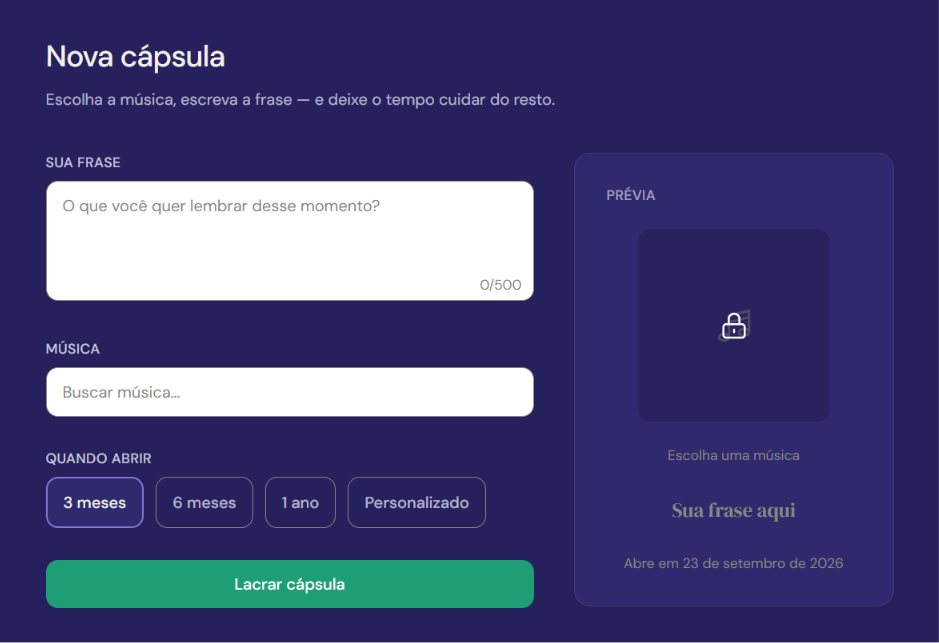
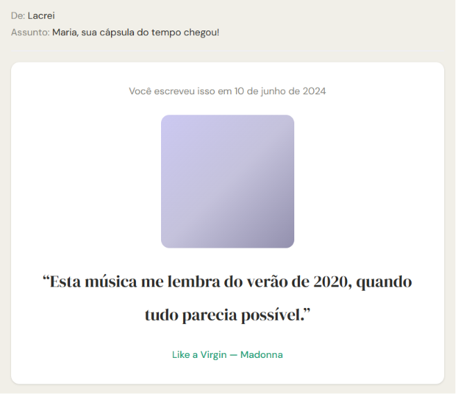

# Lacrei.io

[](https://lacrei-io.vercel.app)

**Lacrei.io** é um diário musical baseado em cápsulas do tempo: cada entrada fica "lacrada" até a data de abertura, quando o usuário recebe um e-mail com o que guardou — música, capa do álbum e frase escrita no passado.

## Como funciona

1. **Escolha uma música e escreva uma frase** — o usuário busca uma faixa (via MusicBrainz/Deezer) e registra o que quer lembrar daquele momento.
2. **Defina quando quer receber de volta** — a data de abertura deve ser pelo menos 7 dias no futuro.
3. **Receba o momento no futuro por e-mail** — quando a data chega, a cápsula é entregue automaticamente na caixa de entrada.

O fluxo completo passa por login (Google ou Discord), criação em `/nova`, confirmação na tela e no e-mail, acompanhamento no diário (`/diario`) e, por fim, a entrega no dia marcado.

## Stack

| Tecnologia                                                 | Uso                                |
| ---------------------------------------------------------- | ---------------------------------- |
| [Next.js](https://nextjs.org/docs)                         | Framework React com App Router     |
| [React](https://react.dev)                                 | Interface do usuário               |
| [TypeScript](https://www.typescriptlang.org/docs)          | Tipagem estática                   |
| [Tailwind CSS](https://tailwindcss.com/docs)               | Estilização                        |
| [Prisma](https://www.prisma.io/docs)                       | ORM e migrations                   |
| [PostgreSQL](https://www.postgresql.org/docs)              | Banco de dados                     |
| [NextAuth.js (Auth.js)](https://authjs.dev)                | Autenticação (Google e Discord)    |
| [Resend](https://resend.com/docs)                          | Envio de e-mails transacionais     |
| [React Email](https://react.email/docs)                    | Templates de e-mail em React       |
| [Zod](https://zod.dev)                                     | Validação de schemas               |
| [date-fns](https://date-fns.org/docs)                      | Manipulação de datas               |
| [MusicBrainz](https://musicbrainz.org/doc/MusicBrainz_API) | Busca de metadados musicais        |
| [Deezer API](https://developers.deezer.com/api)            | Capas de álbum e fallback de busca |

## Como rodar localmente

1. **Clone o repositório**

   ```bash
   git clone git@github.com:guilherme-messias/lacrei.io.git
   ```

2. **Instale as dependências**

   ```bash
   npm install
   ```

3. **Configure as variáveis de ambiente**

   ```bash
   cp .env.example .env
   ```

   Preencha o arquivo `.env` com os valores descritos na seção abaixo.

4. **Execute as migrations do Prisma**

   ```bash
   npx prisma migrate dev
   ```

5. **Inicie o servidor de desenvolvimento**

   ```bash
   npm run dev
   ```

   Acesse [http://localhost:3000](http://localhost:3000) no navegador.

## Variáveis de ambiente

| Variável                 | Descrição                                                                        | Onde obter                                                                                                                                                        |
| ------------------------ | -------------------------------------------------------------------------------- | ----------------------------------------------------------------------------------------------------------------------------------------------------------------- |
| `DATABASE_URL`           | URL de conexão com o PostgreSQL                                                  | [Neon](https://neon.tech), [Supabase](https://supabase.com), [Vercel Postgres](https://vercel.com/docs/storage/vercel-postgres) ou um Postgres local              |
| `NEXT_PUBLIC_APP_URL`    | URL pública da aplicação (usada em links nos e-mails)                            | Em desenvolvimento: `http://localhost:3000`. Em produção: a URL do deploy                                                                                         |
| `NEXTAUTH_SECRET`        | Chave secreta para assinar tokens de sessão                                      | Gere com `openssl rand -base64 32`                                                                                                                                |
| `NEXTAUTH_URL`           | URL base da aplicação para o NextAuth                                            | Em desenvolvimento: `http://localhost:3000`. Em produção: a URL do deploy                                                                                         |
| `AUTH_GOOGLE_ID`         | Client ID do OAuth do Google                                                     | [Google Cloud Console](https://console.cloud.google.com/) → APIs & Services → Credentials → OAuth 2.0 Client ID                                                   |
| `AUTH_GOOGLE_SECRET`     | Client Secret do OAuth do Google                                                 | Mesmo local do Client ID acima                                                                                                                                    |
| `AUTH_DISCORD_ID`        | Client ID do OAuth do Discord                                                    | [Discord Developer Portal](https://discord.com/developers/applications) → sua aplicação → OAuth2                                                                  |
| `AUTH_DISCORD_SECRET`    | Client Secret do OAuth do Discord                                                | Mesmo local do Client ID acima                                                                                                                                    |
| `RESEND_API_KEY`         | Chave de API do Resend para envio de e-mails                                     | [Resend Dashboard](https://resend.com/api-keys)                                                                                                                   |
| `EMAIL_FROM`             | Endereço de remetente dos e-mails (deve estar verificado no Resend)              | [Resend Domains](https://resend.com/domains) — use um e-mail do domínio verificado                                                                                |
| `MUSICBRAINZ_USER_AGENT` | User-Agent obrigatório para a API do MusicBrainz (formato: `App/versão (email)`) | Defina manualmente, ex.: `Lacrei/1.0 (seu@email.com)` — veja [política de uso](https://musicbrainz.org/doc/MusicBrainz_API#Provide_meaningful_User-Agent_strings) |
| `CRON_SECRET`            | Token de autenticação do endpoint de entrega agendada (`/api/cron/deliver`)      | Gere com `openssl rand -base64 32` e configure o mesmo valor no cron da Vercel                                                                                    |

## Telas

### Tela de criação de cápsula



### E-mail de entrega


